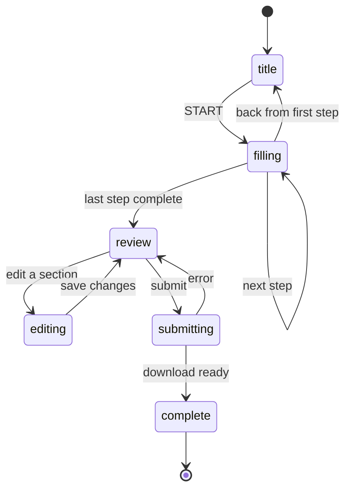

# Forms

This directory contains the state machine, React hooks, and utilities that drive multi-step forms across Namesake.

## Defining a form

Use `createFormConfig` to declare a form. Provide a slug, an ordered list of steps, the PDFs to generate, and a download title.

```ts
// src/pages/forms/my-form/config.ts
import { createFormConfig } from "@/forms/formConfig";
import { nameStep } from "./_steps/NameStep";
import { addressStep } from "./_steps/AddressStep";

export const myFormConfig = createFormConfig({
  slug: "my-form",
  steps: [nameStep, addressStep],
  pdfs: [{ pdfId: "my-form-pdf" }],
  downloadTitle: "My Form",
});
```

### Defining a step

Each step is a `Step` object with an id, title, the fields it collects, and a React component:

```ts
// src/pages/forms/my-form/_steps/NameStep.tsx
import type { Step } from "@/forms/types";
import { FormStep } from "@/components/react/forms/FormStep";
import { ShortTextField } from "@/components/react/forms/ShortTextField";

export const nameStep: Step = {
  id: "name",
  title: "What is your name?",
  fields: ["newFirstName", "newLastName"],
  component: ({ stepConfig }) => (
    <FormStep stepConfig={stepConfig}>
      <ShortTextField name="newFirstName" label="First name" />
      <ShortTextField name="newLastName" label="Last name" />
    </FormStep>
  ),
};
```

The `fields` array tells the form which database fields belong to this step. It controls what gets saved, restored, and shown on the review page.

### Conditional logic (`when` rules)

Steps, fields, and PDFs can be conditionally shown using `when` rules. Rules are evaluated against current form data. If no rule is provided, the item is always visible.

**Rule syntax:**

| Rule | Example | Meaning |
|------|---------|---------|
| `{ field, equals }` | `{ field: "hasUsedOtherName", equals: true }` | Field value equals |
| `{ field, notEquals }` | `{ field: "isUnhoused", notEquals: true }` | Field value does not equal |
| `{ field, includes }` | `{ field: "pronouns", includes: "other" }` | String or array includes value |
| `{ and: [...] }` | `{ and: [rule1, rule2] }` | All rules must pass |
| `{ or: [...] }` | `{ or: [rule1, rule2] }` | At least one rule must pass |

**Conditional steps:** Add `when` to a step to skip it when the `VisibilityRule` evaluates to false. The step is excluded from navigation, review, and PDF output.

```ts
export const feeWaiverStep: Step = {
  id: "fee-waiver",
  title: "Upload fee waiver documents",
  fields: ["reasonToWaivePublication"],
  when: { field: "shouldApplyForFeeWaiver", equals: true },
  component: ({ stepConfig }) => <FormStep stepConfig={stepConfig}>...</FormStep>,
};
```

**Conditional fields:** Use `{ name, when }` in the `fields` array for follow-up questions. In the component, use `useFieldVisible(stepConfig, fieldName)` to show/hide the UI.

```ts
fields: [
  "hasUsedOtherNameOrAlias",
  { name: "otherNamesOrAliases", when: { field: "hasUsedOtherNameOrAlias", equals: true } },
],
// In component:
const otherNamesVisible = useFieldVisible(stepConfig, "otherNamesOrAliases");
<FormSubsection isVisible={otherNamesVisible}>...</FormSubsection>
```

**Conditional PDFs:** Use `{ pdfId, when }` in the form config's `pdfs` array to include a PDF in the final downloaded packet only when the rule passes.

## Form phases

A form moves through six phases:



| Phase | What the user sees |
|---|---|
| `title` | Cover page — form description, PDF list, estimated time |
| `filling` | Step-by-step questions |
| `review` | Summary of all answers |
| `editing` | A single step reopened from the review page |
| `submitting` | Loading state while PDFs are generated |
| `complete` | Success page with options to re-download, restart, or delete data |

When a user returns to a completed form, they land on the completion page rather than starting over.

## Persistence

Field values and form progress are saved automatically. Users can close the browser and resume where they left off.

| What | Hook | Store |
|---|---|---|
| Field values | `useFormData` | `formData` in IndexedDB |
| Form progress | `useFormState` | `formProgress` in IndexedDB |

Restarting a form clears the progress (returning to the title page) but keeps all saved field values.

## Submission

Pass `createFormSubmitHandler` to `FormContainer` as the `onSubmit` handler. It collects the current form values, generates the PDFs, and triggers a download. Only fields that were visible to the user (respecting step and field `when` rules) are written to the PDFs.

```ts
const handleSubmit = createFormSubmitHandler(myFormConfig, form);

<FormContainer
  ...
  onSubmit={handleSubmit}
/>
```
