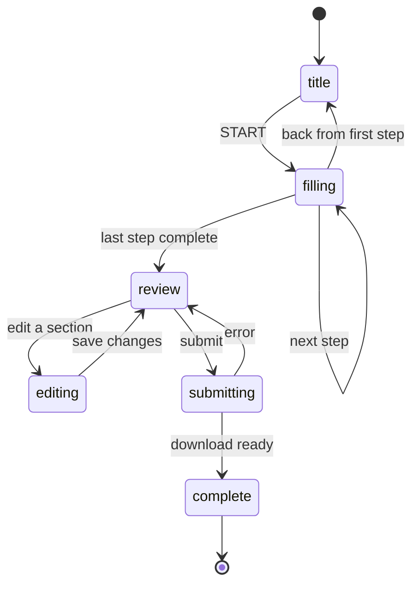

# Forms

This directory contains the state machine, React hooks, and utilities that drive multi-step forms across Namesake.

## Defining a form

Use `defineFormConfig` to declare a form. Provide a slug, an ordered list of steps, the PDFs to generate, and a download title.

```ts
// src/pages/forms/my-form/config.ts
import { defineFormConfig, step } from "@/forms/defineFormConfig";
import { nameStep } from "./_steps/NameStep";
import { addressStep } from "./_steps/AddressStep";

export const myFormConfig = defineFormConfig({
  slug: "my-form",
  steps: [step(nameStep), step(addressStep)],
  pdfs: [{ pdfId: "my-form-pdf" }],
  downloadTitle: "My Form",
});
```

### Defining a step

Each step is a `Step` object with an id, title, the fields it collects, and a React component:

```ts
// src/pages/forms/my-form/_steps/NameStep.tsx
import type { Step } from "@/forms/types";
import { FormStep } from "@/components/react/forms/FormStep";
import { ShortTextField } from "@/components/react/forms/ShortTextField";

export const nameStep: Step = {
  id: "name",
  title: "What is your name?",
  fields: ["newFirstName", "newLastName"],
  component: ({ stepConfig }) => (
    <FormStep stepConfig={stepConfig}>
      <ShortTextField name="newFirstName" label="First name" />
      <ShortTextField name="newLastName" label="Last name" />
    </FormStep>
  ),
};
```

The `fields` array tells the form which database fields belong to this step. It controls what gets saved, restored, and shown on the review page.

### Conditional steps

Add a `guard` to skip a step entirely when a condition isn't met. The step is excluded from the forward and backward flow when its guard returns false.

```ts
export const feeWaiverDocumentsStep: Step = {
  id: "fee-waiver-documents",
  title: "Upload your fee waiver documents",
  fields: ["feeWaiverDocument"],
  guard: (data) => data.shouldApplyForFeeWaiver === true,
  component: ({ stepConfig }) => (
    <FormStep stepConfig={stepConfig}>
      ...
    </FormStep>
  ),
};
```

### Field visibility

Add `isFieldVisible` when a step contains follow-up questions that only apply given a previous answer within the same step. Fields that are not visible are excluded from the review table and PDF output.

In the component, call `useFieldVisible(stepConfig, fieldName)` to get a reactive boolean for showing or hiding that field:

```ts
export const otherNamesStep: Step = {
  id: "other-names",
  fields: ["hasUsedOtherNameOrAlias", "otherNamesOrAliases"],
  isFieldVisible: (fieldName, data) => {
    if (fieldName === "otherNamesOrAliases") {
      return data.hasUsedOtherNameOrAlias === true;
    }
    return true;
  },
  component: ({ stepConfig }) => {
    const otherNamesVisible = useFieldVisible(stepConfig, "otherNamesOrAliases");
    return (
      <FormStep stepConfig={stepConfig}>
        <YesNoField name="hasUsedOtherNameOrAlias" ... />
        <FormSubsection isVisible={otherNamesVisible}>
          <LongTextField name="otherNamesOrAliases" ... />
        </FormSubsection>
      </FormStep>
    );
  },
};
```

## Form phases

A form moves through six phases:



| Phase | What the user sees |
|---|---|
| `title` | Cover page — form description, PDF list, estimated time |
| `filling` | Step-by-step questions |
| `review` | Summary of all answers |
| `editing` | A single step reopened from the review page |
| `submitting` | Loading state while PDFs are generated |
| `complete` | Success page with options to re-download, restart, or delete data |

When a user returns to a completed form, they land on the completion page rather than starting over.

## Persistence

Field values and form progress are saved automatically. Users can close the browser and resume where they left off.

| What | Hook | Store |
|---|---|---|
| Field values | `useFormData` | `formData` in IndexedDB |
| Form progress | `useFormState` | `formProgress` in IndexedDB |

Restarting a form clears the progress (returning to the title page) but keeps all saved field values.

## Submission

Pass `createFormSubmitHandler` to `FormContainer` as the `onSubmit` handler. It collects the current form values, generates the PDFs, and triggers a download. Only fields that were visible to the user (respecting guards and `isFieldVisible`) are written to the PDFs.

```ts
const handleSubmit = createFormSubmitHandler(myFormConfig, form);

<FormContainer
  ...
  onSubmit={handleSubmit}
/>
```
