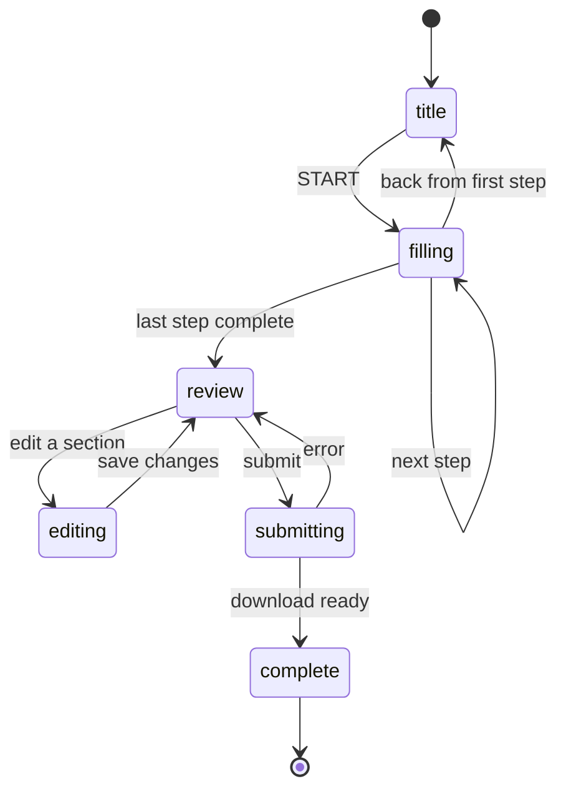

# Forms

This directory contains the state machine, React hooks, and utilities that drive multi-step forms across Namesake.

## Defining a form

Export a plain `FormConfig` object. Provide a slug, an ordered list of steps, the PDFs to generate, and a download title. The XState machine is created automatically by `useFormState` at runtime.

```ts
// src/pages/forms/my-form/config.ts
import type { FormConfig } from "@/constants/forms";
import { nameStep } from "./_steps/NameStep";
import { addressStep } from "./_steps/AddressStep";

export const myFormConfig: FormConfig = {
  slug: "my-form",
  steps: [nameStep, addressStep],
  pdfs: [{ pdfId: "my-form-pdf" }],
  downloadTitle: "My Form",
  instructions: ["Review all documents carefully."],
};
```

### Defining a step

Each step is a `Step` object with an id, title, the fields it collects, and a React component:

```ts
// src/pages/forms/my-form/_steps/NameStep.tsx
import type { Step } from "@/forms/types";
import { FormStep } from "@/components/react/forms/FormStep";
import { ShortTextField } from "@/components/react/forms/ShortTextField";

export const nameStep: Step = {
  id: "name",
  title: "What is your name?",
  fields: ["newFirstName", "newLastName"],
  component: ({ stepConfig }) => (
    <FormStep stepConfig={stepConfig}>
      <ShortTextField name="newFirstName" label="First name" />
      <ShortTextField name="newLastName" label="Last name" />
    </FormStep>
  ),
};
```

The `fields` array tells the form which database fields belong to this step. It controls what gets saved, restored, and shown on the review page.

### Conditional steps

Add a `when` predicate to skip a step entirely when a condition isn't met. The step is excluded from the forward and backward flow when `when` returns false.

```ts
export const feeWaiverDocumentsStep: Step = {
  id: "fee-waiver-documents",
  when: (data) => data.shouldApplyForFeeWaiver === true,
  title: "Upload your fee waiver documents",
  fields: ["feeWaiverDocument"],
  component: ({ stepConfig }) => (
    <FormStep stepConfig={stepConfig}>...</FormStep>
  ),
};
```

### Field visibility

When a step contains follow-up questions that only apply given a previous answer, use the `{ id, when }` or `{ ids, when }` form inside the `fields` array. Fields whose `when` returns false are excluded from the review table and PDF output.

In the component, call `useFieldVisible(stepConfig, fieldName)` to get a reactive boolean:

```ts
export const otherNamesStep: Step = {
  id: "other-names",
  title: "Have you used any other name or alias?",
  fields: [
    "hasUsedOtherNameOrAlias",
    {
      id: "otherNamesOrAliases",
      when: (data) => data.hasUsedOtherNameOrAlias === true,
    },
  ],
  component: ({ stepConfig }) => {
    const otherNamesVisible = useFieldVisible(stepConfig, "otherNamesOrAliases");
    return (
      <FormStep stepConfig={stepConfig}>
        <YesNoField name="hasUsedOtherNameOrAlias" ... />
        <FormSubsection isVisible={otherNamesVisible}>
          <LongTextField name="otherNamesOrAliases" ... />
        </FormSubsection>
      </FormStep>
    );
  },
};
```

For multiple fields sharing one predicate, use `{ ids, when }`:

```ts
fields: [
  "hasPreviousSocialSecurityCard",
  {
    ids: [
      "previousSocialSecurityCardFirstName",
      "previousSocialSecurityCardMiddleName",
      "previousSocialSecurityCardLastName",
    ],
    when: (data) => data.hasPreviousSocialSecurityCard === true,
  },
],
```

## Rendering a form

In your Astro page, render `FormContainer` with a `slug`. It looks up the form config, sets up `useFormData` and `createFormSubmitHandler` internally, and manages the entire form flow:

```astro
<FormContainer
  client:load
  slug="my-form"
  title={form.title}
  description={form.description}
  banner={form.banner}
  updatedAt={form._updatedAt}
  pdfs={pdfs}
  costs={form.costs}
/>
```

## Form phases

A form moves through six phases:



| Phase | What the user sees |
|---|---|
| `title` | Cover page — form description, PDF list, estimated time |
| `filling` | Step-by-step questions |
| `review` | Summary of all answers |
| `editing` | A single step reopened from the review page |
| `submitting` | Loading state while PDFs are generated |
| `complete` | Success page with options to re-download, restart, or delete data |

When a user returns to a completed form, they land on the completion page rather than starting over.

## Visibility resolution

`resolveFormVisibility` (in `formVisibility.ts`) is the single source of truth for what's visible. It takes steps, form data, and PDFs, and returns:

- `visibleStepIds` — steps not excluded by `when` predicates
- `visibleFields` — field values for visible fields only
- `sections` — per-step arrays of visible field names (used by the review table)
- `pdfsToInclude` — which PDFs to include based on their `include` predicates

Navigation, the review table, and the submit handler all use this function.

## Persistence

Field values and form progress are saved automatically. Users can close the browser and resume where they left off.

| What | Hook | Store |
|---|---|---|
| Field values | `useFormData` | `formData` in IndexedDB |
| Form progress | `useFormState` | `formProgress` in IndexedDB |

Restarting a form clears the progress (returning to the title page) but keeps all saved field values.

## Submission

`FormContainer` calls `createFormSubmitHandler` internally. It collects the current form values, resolves visibility, generates the PDFs, and triggers a download. Only fields visible to the user (respecting step and field `when` predicates) are written to the PDFs.
